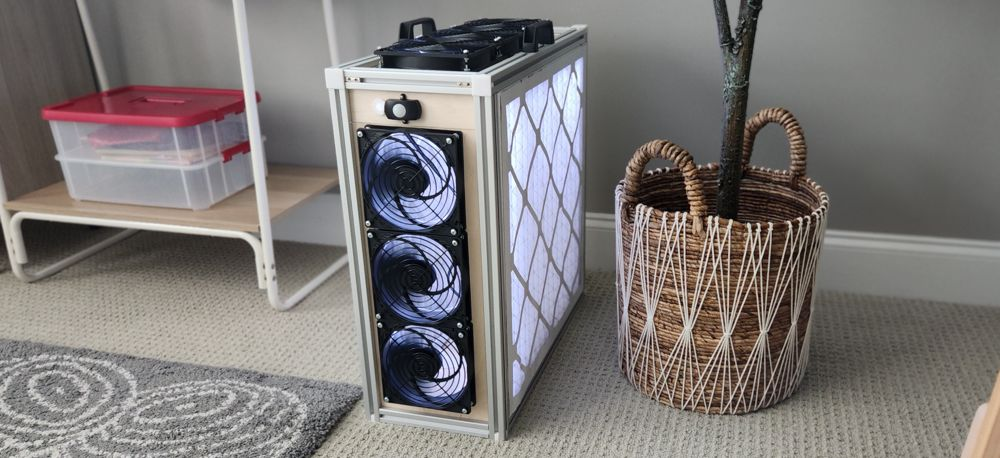

# The Nightingale: An Open-Source, Ultra-Quiet, Automatic, Permanent, Effective Air Purifier With Low Maintenance Costs

A PC-fan based air purifier design, the Nightingale's major features are:  
- **Effective**: Purifies air through two 20x20x2 Merv 13 air filters that are efficient at removing pollen, dust, and infectious aerosols, but have very high air flow.  
- **Ultra-Quiet**: No need to turn it down or off due to noise because you'll barely know it's running. Uses PC fans designed to push a high volume of air quietly. 
- **Permanent**: Uses a strong extruded aluminum frame that is a standard profile (1"x1") and easy to source from several manufacturers. 
- **Automatic**: Turns on when people are present and off when people leave. Always runs at max speed. Nothing to configure (or misconfigure). If it's plugged in, it's on. 
- **Visual Indicator**: Because the PC fans are so quiet, you might not even know it's on, so energy-efficient, interior lights indicate it is purifying. 
- **Easy Filter Change**: When you change the filters simply pop them off the side and replace. No disassembly required.
- **Cheap Maintenance**: No pricey filter replacement costs. Simply use standard Merv 13, 20x20x2 furnace filters commonly available in the US that cost around $10-$15 per filter (or less when purchased in bulk). Change yearly or after wildfire events. 
- **Standard Parts**: If you have a problem, you can fix it yourself. 
- **Open-Source**: No vendor lock-in. Build it. It's yours. 
- **Low Energy Consumption** Consumes only enough electricity for 6 PC fans and energy-efficient LED lighting. Turns off when the room is empty. 
- **Slim Design**: About the size of a desktop computer, it doesn't take up much space. 
- **Easy Wiring**: Uses standard connectors interior connectors (dc) that plug together. No soldering required.  

# Release Notes

## Version 1 - Baseline
Released on August 4, 2024. 

# Materials

You can likely do a better job sourcing materials in the quantity you need and obtaining a lower price. This is mostly just a list of all the items you would need to build a box and their approximate cost. 

## Aluminum Frame

Tnutz is a supplier of extruded aluminim. You can order specific lengths pre-cut. It takes about 5-8 days for processing. We use 1" x 1" t-slot frame, which is also known as 1010 t-slot frame. 

| Quantity | Type | Length | Fractional length | Total Length | Machining for one end | Machining for other end | Link  |
|----------|------|--------|-------------------|--------------|-----------------------|-------------------------|-------|
| 8 | 1"x1" | 20" | 0.500" |  20.5" | No machining | No machining | [LINK](https://www.tnutz.com/product/ex-1010/?attribute_pa_length-in=20&attribute_pa_fractional-length=0-500-1-2)
| 4 | 1"x1" | 7" | 0.063" (1/16) |  7.063" | No machining | No machining | [LINK](https://www.tnutz.com/product/ex-1010/?attribute_pa_length-in=7&attribute_pa_fractional-length=0-063-1-16)

## Panels 

We use 1/4" unfinished plywood for the panels because it's an inexpensive, durable material that is easy to find. You can source plywood in 4" x 8" sheets from any hardware store and then cut them down to manageable sheets using a table saw. Alternatively, MakerStock sources plywood in smaller sizes that is idea for GlowForge laser cutting.  

| Quantity | Type | Thickness | Size | Cost/Piece | Link  |
| ------ | ----- | ---- | ---- | -----  | -----  |
| 4 | Baltic Birch Plywood | 1/4" | 12x20 | $4.25/sheet |  [LINK](https://makerstock.com/products/baltic-birch-plywood?variant=32477598580833)  |

### Glowforge Lasercutter
The Glowforge is a popular small laser cutter. The glowforge size is slightly too small for the exact panel size that we need, so we break each panel into 2 parts -- the main part and a additional slat. 

See the LaserCut/SmallLaser folder for SVG files. Note that 2 of the panels are duplicates and so you need to cut them twice. 

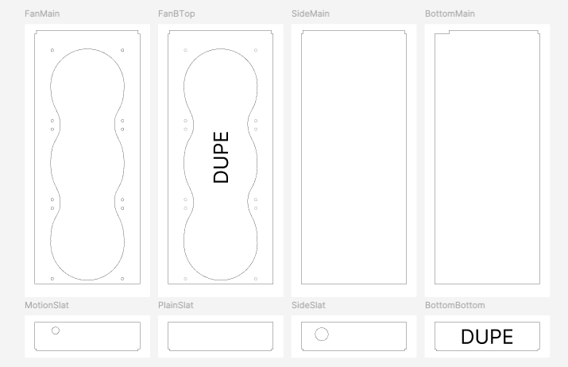

To minimize burning of the material, we highly recommend covering the top face of the material with masking tape. Also, after cutting, we recommend sanding edges and inside the holes to eliminate the smoke smell. You don't want a purifier that smells like smoke!

### Large Laser Cutter
With a larger lasercutter, you can cut the entire panel in 1 piece. 
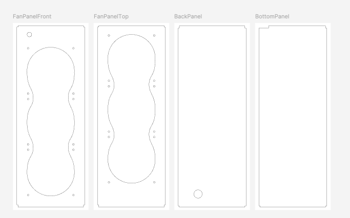

To minimize burning of the material, we highly recommend covering the material with masking tape. Also, after cutting, we recommend sanding edges and inside the holes to eliminate the smoke smell. You don't want a purifier that smells like smoke. 

### CNC
Instead of lasercutting, you can use a CNC to cut the panels. This is preferred to avoid having to sand off burnt material. Refer to the large laser cutter files for panel sizes or the primitives folder. 

*More instructions for CNC coming soon!*

## 3-D Printed Components

Required
| Quantity | Item | Purpose | Filename | Image | 
| ------ | ----- | -----| ----- | ------ | 
| 8 |  Filter Holder | Because the fans are mounted outside, the filter needs something to rest against | 3dPrinted\FilterHolder.stl | 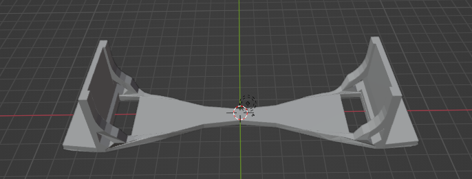

Optional
| Quantity | Item | Purpose | Filename | Image | 
| ------ | ----- | -----| ----- | -------| 
| 8 |  End Cap | Cover sharp edges / protect scratches | 3dPrinted\EndCap.stl | 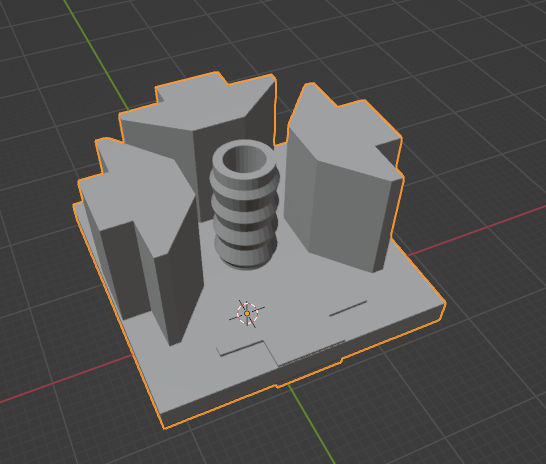
| 1 | Grommet | Cover the hole where the motion sensor runs| 3dPrinter\Grommet-Laser.stl | 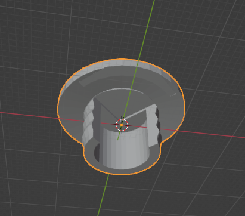

NOTE: The end cap is a standard part and can be obtained elsewhere from TNutz, 80/20, and Amazon. Ensure the cap is 1"x1" (10 series, aka 1010). Also, you can get a rubber grommet from a hardware store.

## Interior Components 
| Quantity | Item | Description | Cost | Link  |
| -------- | -----| --------- | ---- | ----- | 
| 1 | 5-Pack of Artic P14 PC Fans | Discounted pack of 5 fans | $35 | [LINK](https://www.amazon.com/dp/B07HC9ZWDN?psc=1&ref=ppx_yo2ov_dt_b_product_details) |
| 1 | Artic P14 PC Fans | Single P14 PC Fan (to make 6 total) | $16 | [LINK](https://www.amazon.com/dp/B07GZJY4TM?psc=1&ref=ppx_yo2ov_dt_b_product_details) |
| 2 | 3-pack of 140 mm fan grills | Covers the fan for safety | $9 | [LINK](https://www.amazon.com/dp/B01BW21DXC?psc=1&ref=ppx_yo2ov_dt_b_product_details)
| 1 | Adafruit DC Barrel Adapter | Using a 1" hole, this screws on the panel and provides a nice way to plug in the outside ac/dc power adapter | $3 plus shipping | [LINK](https://www.adafruit.com/product/610)
| 1 | AC/DC Adapter | Needs to be compatible with power where you are plugging it in (normally 110 volts in the US) and change to 12 volt, ~2 amp DC power | $5/each | [LINK](https://www.amazon.com/dp/B077PW5JC3?ref=ppx_yo2ov_dt_b_product_details&th=1)
| 1 | PWM Fan Hub | Connects all the fans to single power cable | $6 | [LINK](https://www.amazon.com/dp/B08C79CQH5?psc=1&ref=ppx_yo2ov_dt_b_product_details)
| 1 | DC Power 1 Female to 2 Male Y-Splitter | Splits DC power into two for lights and fan hub | $2 | [LINK](https://www.amazon.com/Splitter-Adapter-Y-Cable-Security-Parking/dp/B07J28SX6Y?th=1)
| 1 | PIR Motion Sensor | Activates the circuit when motion is detected | $6/each | [LINK](https://www.amazon.com/dp/B09PHHZMQN?psc=1&ref=ppx_yo2ov_dt_b_product_details)
| 1 | DC Extension Cable | Runs from the back of the unit to the front, where the motion sensor sits | $6 | [LINK](https://www.amazon.com/Power-Extension-Cable-5-5mm-Female/dp/B08176VFJ5?th=1) 
| 1 | DC to 4 Pin Fan Power | Converts DC power to 4 pin for the fans | $7 | [LINK](https://www.amazon.com/dp/B085S3Q7VH?psc=1&ref=ppx_yo2ov_dt_b_product_details)
| 1 | DC to LED light connector | Connects DC power to 2 pin LED lights that are 8 mm wide | $1/each | [LINK](https://www.amazon.com/dp/B01DM7F8O0?psc=1&ref=ppx_yo2ov_dt_b_product_details)
| 1 | String of 8mm LED lights | Any solid color, can be cut at specific intervals | $12 | [LINK](https://www.amazon.com/gp/product/B075LB9HK2/ref=ppx_yo_dt_b_search_asin_title?ie=UTF8&th=1)
| 1 | 20-pack of 1010 L-Shape Corner Connectors | Used to connect the aluminum pieces into a box | $28 | [LINK](https://www.amazon.com/dp/B09F67JQR1)
| 1 | 30-count M4 x 40-mm machine screws | To attach the grill to the fans and the fans to the panel, you need some relatively long machine screws | $6 | [LINK](https://www.lowes.com/pd/Hillman-4mm-0-7-x-40mm-Phillips-Slotted-Combination-Drive-Machine-Screws-30-Count/999994818)
| 2 | 16-count M4 nuts | To attach the grill to the fans and the fans to the panel, you need some relatively long machine screws | $3/each | [LINK](https://www.lowes.com/pd/Hillman-4mm-x-0-7-Zinc-Plated-Steel-Hex-Nut-16-Count/999995424)
| 2 | Plastic Handle | Screws into the wood slot and makes carrying the unit easier. | $5/each | [LINK](https://www.tnutz.com/product/han-015/)
| 2 | Tiny wood screws | To mount the motion sensor into the wood panel, you need some very small screws. Recommended size is about <.5" in length. You likely have something already that would work.

## Filter
| Quantity | Item | Description | Cost | Link  |
| -------- | -----| --------- | ---- | ----- | 
| 2 | Merv 13 20x20x2 Furnace Filter | Filter medium | $10/each | [LINK](https://www.amazon.com/gp/product/B0BL4XBTLN?th=1) |

Note: 20x20 furnace filters are NOT 20" long. They are always a little smaller. I designed this purifier to fit a filter with an actual filter size of 19 1/2" x 19 1/2". I do not know how much the furnace filter size varies by manufacturers other than the one above, but I do know most of them are smaller than 20". If your filter is bigger than 19 1/2" it likely won't fit this case. You can make the case a little larger while connecting with the l-connectors to accommodate, but at a certain size the panels won't fit. If the furnace filter is smaller than 19 1/2", probably not a big deal as you can always add foam tape to the outside to get a more snug fit. 

## Other Parts and Tools
- Screwdriver - Connecting the fans to the panels
- Rubber mallet - Helps get stuff to fit snugly w/o damaging it
- Wood Glue - For affixing the filter holders
- Utility knife - Cutting zip ties, opening packages
- Sandpaper - Removing lasercut edges
- Cable ties - Organizing the wiring

# Assembly
1. Take four of the 20.5 aluminum pieces and assemble into a square using the L-shape connectors on the side corner (see diagram). Do the same for the other 4 20.5 aluminum pieces. Tighten the screws, but not too tight, because you'll loosen them later. 

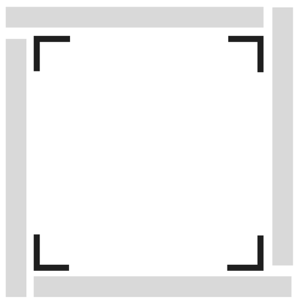

2. Connect the four 7.063" cross beams to form a cube. You use the same L-shape connector as you did earlier, however, you need to configure it in a slightly different way, which puts most of the L-shape connector on the outside of the cross beam. This orientation leaves more space inside the grooves for panels. Tighten all these l-connector screws. No need to overtighten them. (NOTE: We'll untighten one of the l-connectors at the end for the final panel). 

Also, make sure the two squares you made in Step 1 are oriented in the same way with respect to each other (see panel order diagram below)

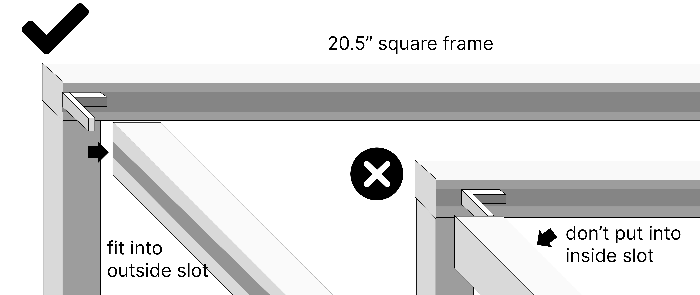

3. Add the panels in the sequence shown from 1 to 4. Arrows indicate distinguishing parts of the panels. 

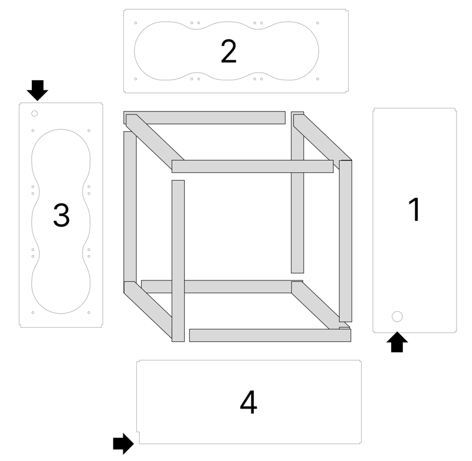

For panels 1-3, you will loosen the specified screws underneath where the panel will go (note: the panel is already inserted in the image). 

When you loosen these particular screws, a u-shaped portion of the frame will slide out, allowing you to fit the panel inside the grooves and slide back into place.

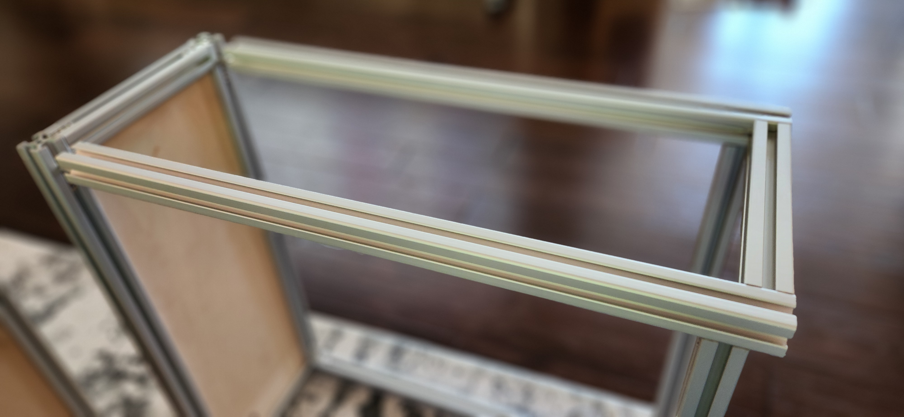

Also note that the corner spaces inside the grooves are different on each side. On one side, the corner is free of any l-shape bracket and has more space (see below). 

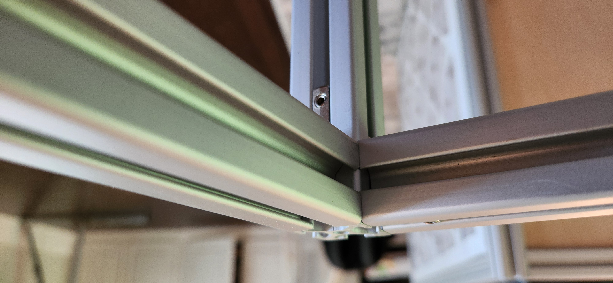

On the other side, there is a small part of l-shape bracket visible (see below). 

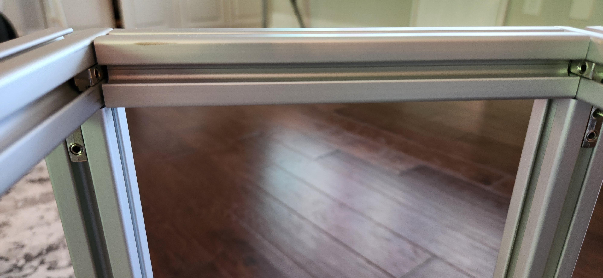

Be sure you have the panel corners matching to the right interior corners for it to fit properly. Once you have the orientation correct, you can slide the u-shape frame back into place and re-tighten the screws you loosened. You can then move to the next panel section. It's a bit like a puzzle. You can add panels only in 1 direction, but not the other because the panel will keep the frame from sliding out if you go the wrong way.

4. On the final panel, you have to only loosen the screws on one side beam as shown. This allows one beam to slide out and you can add the final panel and tighten. Note that this panel is specifically cut to allow you to tighten the right screw after the panel and beam has slid back into place. 

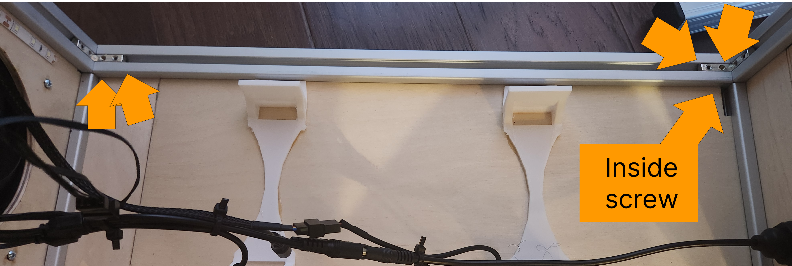

5. Add the PC fans to PC fan panels using machine screws and bolts. For each fan, it should sit outside the frame, with the logo pointing inside (NOTE: This is counter-intuitive. The PRETTY side, i.e., the side with the nice company logo, points INSIDE), and a grill covering the outside. Ensure the connecting wires are inside the box. Try to arrange the fans so the fan wires are mostly together, which will make it easier to wire later. The machine screw should have the head outside on the grill, go through the grill hole, the fan, and the panel. Put the nut inside to hold it together. Add a washer if you like to protect the wood. (Note: In the diagram, I'm using 2 shorter screws + nuts, so just ignore that. I think 1 longer screw + 1 nut is better as it's fewer screws and easier to assemble.)

6. Now take the 3d-printed filter holders and glue them with wood glue inside the box. The filter holders give the filters something to push against and also give you a place to use a zip tie to organize the wiring. Each panel should have 2 filter holders. Glue two at a time and cover with a heavy book until the glue dries. Then rotate the box 90 degrees and glue two more. (Images shown with wiring, which you haven't done yet).

The filter holders also fit as shown over the fans, the gap in the filter holder is where the connection screws go. For the panels with fans, only apply glue to the *ends* of the filter holder, not the middle (so you don't add glue to the fan, if you need to replace it later).

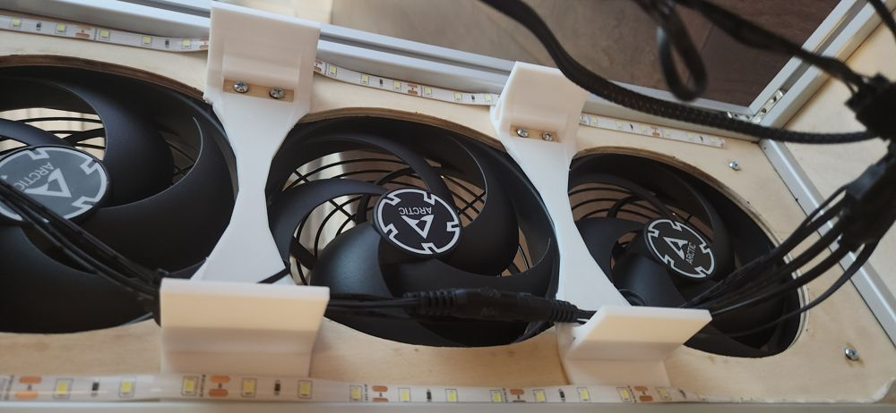

7. Now we can start to add the wiring. You'll screw the DC Barrel into the panel where there is the larger 1" hole on an otherwise bare panel (the first panel you added). 

A high-level schematic of the wiring is here: 

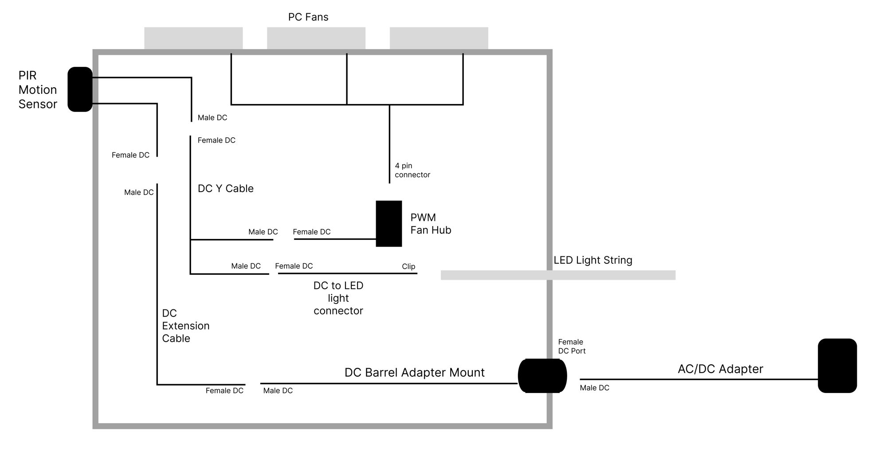

8. Daisy-chain the fans together as much as you can. The 5-pack of Artic fans should have extra ports to connect one fan to another. Daisy-chaining them saves you ports on the PWM Fan Hub and makes organizing wires easier, but you can always run the fan directly to the PWM Fan Hub. 

9. Connect the DC extension cable to the DC Barrel Adapter Mount inside. The PIR Motion Sensor should be on the outside with cables running inside through the small hole. One cable will connect to the DC extension cable and the other will connect to the DC Y Cable. From the Y Cable, you'll split into LED lighting and the PWM Fan Hub. All the fans will connect to each other and the hub.

10. For the LED lighting, I like to run it on the panels with fans in a figure 8 pattern around both panels, sticking to the 1/2" gap between the panel and the filters, where it won't get in the way of the filters when inserted(see below). This provides indirect lighting when activated, giving the unit a glow. 

11. Ensure all the wiring is connected and nothing is near the fans. Plug in the AC/DC adapter in to test the wiring. Check for the following
- The unit should come on when the PIR sensor detects motion. 
- The PC fans should all blow air outside, not inside.  
- All the fans are spinning when motion is detected.
- Adjust the PIR motion sensor on the back of the unit with a screwdriver to maximum sensitivity/duration. This ensures it will come on quickly and stay on for a few minutes.  

12. If you're confident the wiring is correct, you can zip tie everything down to the holes on the filter adapter. Make sure that you've tied it down so that the DC connections won't easily come loose and that the wires won't move and get into the fan blades as the unit is being moved around. 

13. Tighten all interior l-shape connectors sufficiently (no need to over tighten it).

14. Press the 20x20x2 furnace filters into the square side. The airflow is from outside to inside though the filter. The metal supports on the filter should be inside. 

15. Add the 3-d printed grommet (or one from a hardware store) to the PIR sensor hole. If you want, you can cover the small hole in the bottom panel with a piece of tape. 

16. Add the handles to the t-slot on the top of the unit as shown in the first picture.

17. Also, you can add the end caps to the aluminum ends so that you don't scratch flooring or people. Once you add the end covers, you can't add anything else to the t-slot, so this is really the last step everything has gone well so far. 

18. Plug the unit in and ensure the PIR sensor is pointed at where there is most likely to be people, so it can come on when people are present. 

## FAQs

### Q: Why buy this instead of HEPA? 

- A: A HEPA filter is originally based on [World War II gas masks](https://en.wikipedia.org/wiki/HEPA), which explains the high efficiency. However, the high efficiency/low airflow is a disadvantage when purifying a room. HEPA purifiers tend to be big, loud, and have costly filter replacements. Furnace filter-based designs that use PC fans are an amazing combination of quiet and highly effective. 

### Q: What's the ideal environment for this design?

- A: I designed this as the purifier I would want in my kid's classroom. In particular, I want to be able to tell my kid to make sure the purifier is running, which is obvious from the LED lighting. Also, I don't want teachers to worry about turning it off/on or changing the speed settings. Finally, I wanted it to be durable, easy to fix if a component breaks, and easy to replace the filters. 

- In cases where classroom space is limited, we're exploring whether we can mount this unit to a wall with aluminum stand-offs. A wall-mount option could save space and keep people from accidentally turning it off. 

### Q: Why is it named 'The Nightingale'? 

- A: [Florence Nightingale](https://en.wikipedia.org/wiki/Florence_Nightingale) (1820-1910) was an activist, statistician, and the founder of modern Nursing. In her book, [*Notes on Nursing: What It Is, and What It Is Not*](https://archive.org/details/notesnursingwhat00nigh/page/6/mode/2up), she writes: 

> The very first canon of nursing, the first and the last thing upon which a nurse's attention must be fixed, the first essential to the patient, without which all the rest you can do for him is as nothing, with which I had almost said you may leave all the rest alone, is this: **TO KEEP THE AIR HE BREATHES AS PURE AS THE EXTERNAL AIR, WITHOUT CHILLING HIM.** 

### Q: What is the clean air delivery rate (CADR) of this unit? 

- A: I haven't tested it yet myself or had it tested by a reputable third party. Having similar dimensions and PC fan design (six P14 Artic PC fans) as the Nukit Tempest, it should have a similar CADR. 

## Future Directions

Some changes I'd like to make in the future ... 

- Tweak the panel size to better fit in the grooves w/ no slack. 
- Use a CNC instead of laser cutter to make full-size panels w/ no sanding. 
- Iterate on the design based on feedback. 

## Acknowledgements

- [Corsi-Rosenthal Box](https://en.wikipedia.org/wiki/Corsi%E2%80%93Rosenthal_Box): In 2020, Corsi and Rosenthal popularized a simple DIY air purifier for removing airborne infectious disease using a box fan, furnace filters, and duct tape. At the time, the idea that a Merv 13 furnace filter, which has only [85% efficiency with tiny particles](https://www.ncbi.nlm.nih.gov/pmc/articles/PMC7127325/) could be better than HEPA filtration which has 99.99% efficiency seemed controversial. However, the key insight was that Merv 13 furnace filters had much better airflow than HEPA filters, which meant the total amount of clean air was much more. Disadvantages of the CR Box was only that it takes up space, the box fan can be louder than ideal for a classroom, and it's a temporary solution made with duct-tape and is not extremely sturdy. [The Corsi-Rosenthal Foundation](https://corsirosenthalfoundation.org/) is a non-profit dedicated to promoting clean air and provides support to related charitable projects. 

- [Nukit Tempest](https://cybernightmarket.com/products/the-nukit-tempest-air-purifier-kit): An innovative and durable DIY air purifier design, the Tempest is made of metal and highly resembles a PC case. It's sleek and black, the 6 P14 fans are mounted inside, and it also takes 20x20x2 furnace filters. Overall, a near perfect design. It's only weaknesses are that you need to slightly disassemble the unit to replace the air filters, and you may not be able to tell that it's plugged in and running (because it's so quiet). Estimates are around 260-280 CFM. [A highly-recommended design](https://housefresh.com/nukit-tempest-review/) for situations where you want durable, simple, and ultra-quiet air cleaning. 

- [AirFanta Pro](https://www.amazon.com/AirFanta-based-Rosenthal-Purifier-3813ft2/dp/B0CJTYWQBT): Amazingly powerful and compact design using custom filters and PC fans, the 3Pro gets 430 CFM at full speed. It has a configurable adapter, which means if you don't mind the noise, you can crank it to max. However, if you want to limit the noise, you can lower the power. Importantly, this purifier is extremely portable -- you can pack it up inside a suitcase and take it with you. It's an absolute steal at $150, especially considering the amazing cleaning power. I own several of these and enthusiastically recommend them to others. In particular, in schools where noise might not be as much of an issue (e.g., cafeteria, common areas), I think this is likely the best bang-for-the-buck. In classrooms, you can also purchase 2 of them and turn them to half speed.

- [CleanAirKits](https://www.cleanairkits.com/): The original DIY purifier kit builders, they offer many kit models with a lot of cleaning power using ultra-quiet PC fans. They've researched a ton of different PC fans and identified the good ones. I own several Tower of Power models and have recommended them often to friends. In fact, a luggable protects my dad when he's in the office meeting people. 

- My friend Tony, who recommended I check out aluminum frames for air purifiers and provided feedback. 